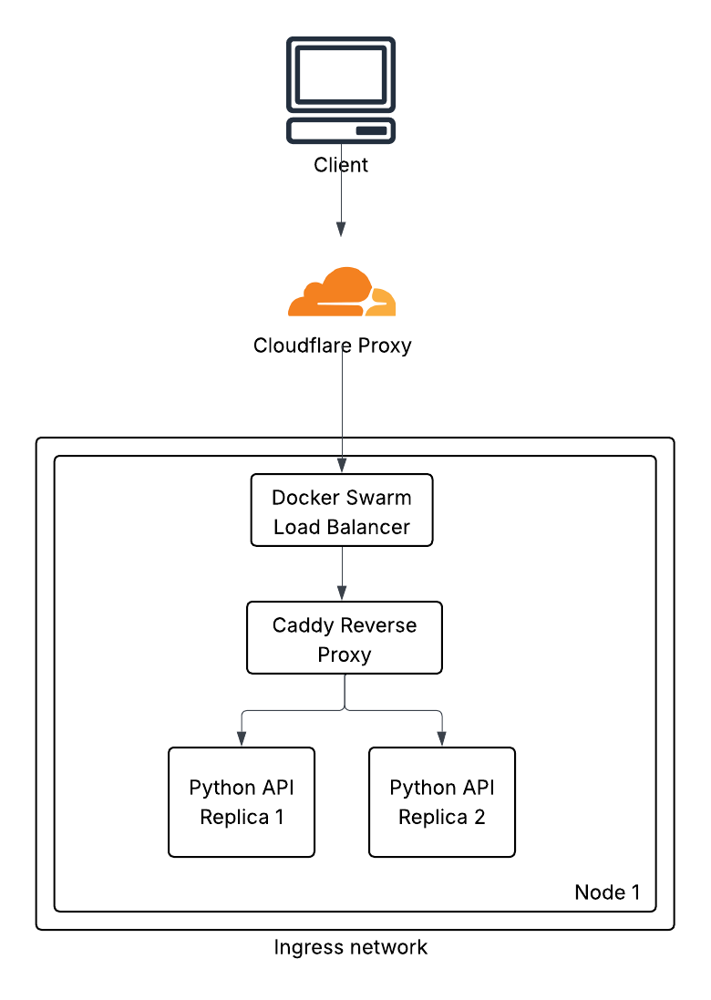

## Architecture Overview

## Cloudflare
We are behind a Cloudflare proxy which we mainly use for DDoS protection.

## Docker Swarm
We chose [Docker Swarm](https://docs.docker.com/engine/swarm/) over [K8s](https://kubernetes.io/) as our orchestration system due to its simplicity and the fact that it comes built into Docker directly.
Because of Docker Swarm we are able to have a [Rolling Update](https://youtu.be/AWVTKBUnoIg?t=94) deployment strategy, resulting in zero downtime when we release new versions.
Currently, we are operating on a single Node, but this could change in the future and docker swarm would allow us to have a [multi-node](https://docs.docker.com/engine/swarm/how-swarm-mode-works/nodes/) cluster.
We chose to use the [ingress network](https://docs.docker.com/engine/swarm/networking/#key-network-concepts) as our load balancer, because:
* [Publish ports directly to the ingress network](https://docs.docker.com/engine/swarm/ingress/#publish-a-port-for-a-service) allows our Caddy server to update without downtime (See `docker-swarm-stack.yml` for more info).
* It's simpler than configuring our own load balancer via [dnsrr](https://docs.docker.com/engine/swarm/ingress/#without-the-routing-mesh), as we don't have to worry about DNS caching, [health checks](https://caddyserver.com/docs/caddyfile/directives/reverse_proxy#active-health-checks), and so on.
While the IPVS module (the Linux kernel LB at Layer 4) adds a little overhead it's negligible especially on a single node setup, and for us simplicity more important than tiny performance gains.
The overhead comes, as the request comes first via Docker Swarm's [routing mesh](https://docs.docker.com/engine/swarm/ingress/) and then it is passed to Caddy. We could avoid this by [bypassing the routing mesh](https://docs.docker.com/engine/swarm/ingress/#bypass-the-routing-mesh) and using Caddy directly as our LB, but this requires more effort to configure properly, and also we loose the ability to do a rolling release of Caddy (`start-first` deploy config), considering the fact that we are currently running on a single Node.
## Caddy
[Caddy](https://caddyserver.com/docs/) acts as our web server, serving our static assets, as well as a reverse proxy for our backends. By using a
reverse proxy we don't have to directly expose our backends to the open internet via [published ports.](https://docs.docker.com/get-started/docker-concepts/running-containers/publishing-ports/)
We chose Caddy mainly because it [provides us automatically](https://caddyserver.com/docs/automatic-https) with SSL certs, and renews them for us. This saves us a ton of effort especially in our setup, as otherwise we would have to renew them ourselves.
Renewing certs is not a trivial task, especially in containerized environments not running on K8s, using traditional tools such as [Certbot](https://certbot.eff.org/) and [Nginx](https://nginx.org/) [without downtime](https://api7.ai/blog/how-nginx-reload-work).

## Python API
For our Python API we chose [FastAPI](https://fastapi.tiangolo.com/) as currently this is the de facto standard for developing web APIs using the new [ASGI specification](https://asgi.readthedocs.io/en/latest/specs/main.html). We chose an [async model](https://fastapi.tiangolo.com/async/#asynchronous-code) as
our application is heavy on I/O bound operations, where this model works great especially on a single thread. Yes Python is not single threaded, but creating one thread per I/O bound operation is an expensive procedure, as the threads created by Python are not [green threads](https://en.wikipedia.org/wiki/Green_thread), and if the
language provides a special paradigm for I/O bound operations we might as well use it. @Isak-Bego wrote a fantastic discussion about the async model in Python, you can check it out [here](https://github.com/AUBGTheHUB/monolith/discussions/774) for more details.

## Mongo DB
The choice of MongoDB as our database is a historical one. When the [first version](https://github.com/AUBGTheHUB/monolith/releases/tag/1.0.0) of the website was developed, we decided to go with a Document database, as we were not sure how our schema might change in the future. Also, Mongo provides us with a [free managed cluster of shards](https://www.mongodb.com/products/platform/atlas-database),
which removes the hassle of managing this HA database setup.

## AWS S3
We use S3 to store our static files such as images.

## Frontend stack
For the frontend we chose [React](https://react.dev/) with [Vite,](https://vite.dev/guide/) along with [Shadcn](https://ui.shadcn.com/) and [Tailwind.](https://tailwindcss.com/)
