# Architecture overview

For the architecture of the Python API we chose the [Controller-Service-Repository](https://tom-collings.medium.com/controller-service-repository-16e29a4684e5) as our model of choice.
This model provides us with clear separation of concerns and helps us achieve a more modular codebase.

## Error handling
We chose to use the [Result pattern](https://medium.com/@wgyxxbf/result-pattern-a01729f42f8c) to provide a more determinist approach to error handling, and force developers to think about how to handle the error which
might be returned by a function, rather than rebelling on a top-level Exception handler.

## Service layer
Here we store our business logic related to hackathon registration, mailing and so on. You can check the whole registration flow [here.](https://excalidraw.com/#json=7L64_2tnTYzpwU46FXF2V,IyMBQVvENzmAa7ULXWP5Fw)

## Repository layer
Here we store all of our logic related to database operations. We use a so-called [Data Models](https://www.ibm.com/think/topics/data-modeling) to repsent how one entity looks like in our Database in a type-safe manner.

## Controller (HTTP handler)
We use the term "HTTP handler" to refer to the controller part of the architectural model. These HTTP handlers act as dispatchers forwarding requests to the different parts of the service layer.

## Dependencies
We use [Dependency injection](https://www.youtube.com/watch?v=J1f5b4vcxCQ) as a pattern which allows us to more easily write unit tests, and also clearly defines the contract between layers, without hiding which components are used as dependencies.

Here is a visual representation of our dependency graph:

```mermaid
graph TD
    subgraph Database_Layer
        direction TB
        db_client_provider["mongo_db_client_provider()"]
        db_manager["db_manager (MongoDatabaseManager)"]
        tx_manager["tx_manager (MongoTransactionManager)"]
        participants_repo["participants_repo (ParticipantsRepository)"]
        teams_repo["teams_repo (TeamsRepository)"]
        fs_repo["fs_repo (FeatureSwitchRepository)"]
        app_state_fs_repo["app.state.fs_repo (stores fs_repo)"]

        db_client_provider -->|client| db_manager
        db_client_provider -->|client| tx_manager
        db_manager -->|db_manager| participants_repo
        db_manager -->|db_manager| teams_repo
        db_manager -->|db_manager| fs_repo
        fs_repo --> app_state_fs_repo
    end

    subgraph Service_Layer
        direction TB
        jwt_utility["jwt_utility (JwtUtility)"]
        mail_client_factory["mail_client_factory()"]
        mail_client["mail_client"]
        hackathon_mail_service["hackathon_mail_service (HackathonMailService)"]
        fs_service["fs_service (FeatureSwitchService)"]
        hackathon_service["hackathon_service (HackathonService)"]
        participants_reg_service["participants_reg_service (ParticipantRegistrationService)"]
        participants_verification_service["participants_verification_service (ParticipantVerificationService)"]

        mail_client_factory -->|MailClients.RESEND| mail_client
        mail_client -->|client| hackathon_mail_service
    end

    subgraph Handler_Layer
        direction TB
        utility_handlers_inst["UtilityHandlers"]
        fs_handlers_inst["FeatureSwitchHandler"]
        hackathon_mgmt_handlers_inst["HackathonManagementHandlers"]
        participant_handlers_inst["ParticipantHandlers"]
        verification_handlers_inst["VerificationHandlers"]
        http_handlers["http_handlers (HttpHandlersContainer)"]

        utility_handlers_inst -->|utility_handlers| http_handlers
        fs_handlers_inst -->|fs_handlers| http_handlers
        hackathon_mgmt_handlers_inst -->|hackathon_management_handlers| http_handlers
        participant_handlers_inst -->|participant_handlers| http_handlers
        verification_handlers_inst -->|verification_handlers| http_handlers
    end

    %% Cross-layer Dependencies
    fs_repo -->|repository| fs_service

    participants_repo -->|participants_repo| hackathon_service
    teams_repo -->|teams_repo| hackathon_service
    fs_repo -->|feature_switch_repo| hackathon_service
    tx_manager -->|tx_manager| hackathon_service
    hackathon_mail_service -->|mail_service| hackathon_service
    jwt_utility -->|jwt_utility| hackathon_service

    hackathon_service -->|hackathon_service| participants_reg_service
    jwt_utility -->|jwt_utility| participants_reg_service

    hackathon_service -->|hackathon_service| participants_verification_service

    db_manager -->|db_manager| utility_handlers_inst
    fs_service -->|service| fs_handlers_inst
    hackathon_service -->|service| hackathon_mgmt_handlers_inst
    participants_reg_service -->|service| participant_handlers_inst
    participants_verification_service -->|service| verification_handlers_inst
    jwt_utility -->|jwt_utility| verification_handlers_inst

    %% Styling (optional, for better readability if rendered)
    classDef db fill:#cde4ff,stroke:#333,stroke-width:1px;
    classDef service fill:#cff2e4,stroke:#333,stroke-width:1px;
    classDef handler fill:#fff7d6,stroke:#333,stroke-width:1px;
    classDef provider fill:#efddf5,stroke:#333,stroke-width:1px;
    classDef util fill:#f0e6f2,stroke:#333,stroke-width:1px;

    class db_client_provider,mail_client_factory provider;
    class db_manager,tx_manager,participants_repo,teams_repo,fs_repo,app_state_fs_repo db;
    class jwt_utility util;
    class mail_client,hackathon_mail_service,fs_service,hackathon_service,participants_reg_service,participants_verification_service service;
    class utility_handlers_inst,fs_handlers_inst,hackathon_mgmt_handlers_inst,participant_handlers_inst,verification_handlers_inst,http_handlers handler;
```

