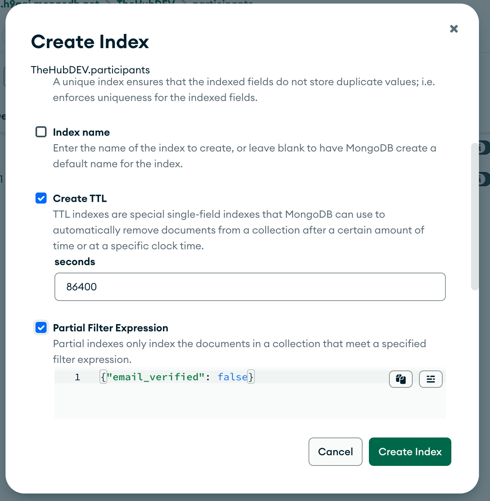
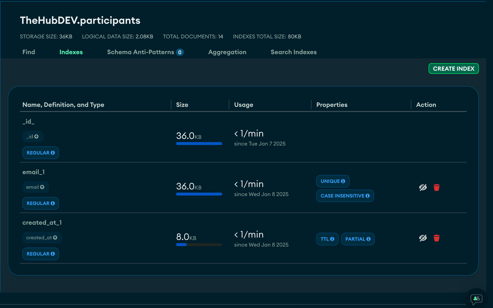
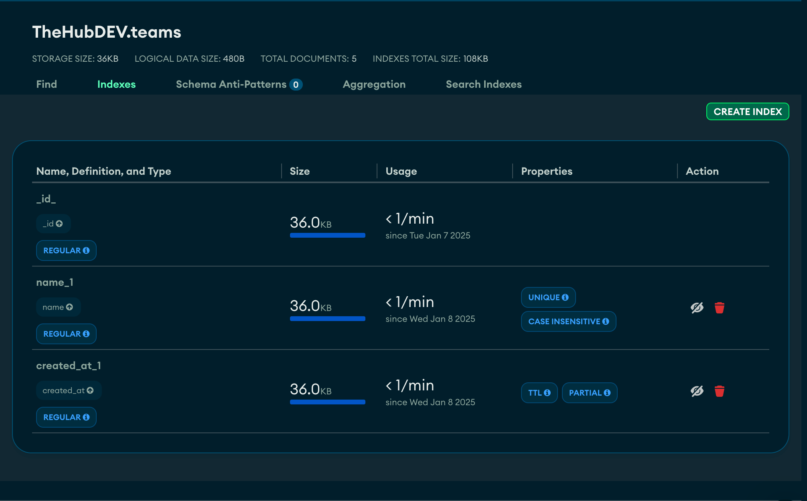

# Hack AUBG Database Indexes Mongo
There is a unique index over `email` in participants table and over `name` in teams table.

These unique indexes work for emails in latin english letters and are case insensitive. To achieve this we define the following collation:

```json
{
locale: 'en',
strength: 2
}
```

There is a TTL index over created_at for both teams and participants if they are not verified.

What are we trying to achieve?

If a certain amount of time has passed since the document was created and the team or participant document is not verified then it it will be removed from the database.

How is it done?

You can Google multiple ways, however one of the easiest is using the MongoDB Compass Desktop App:



## List of indexes for participants:


## List of indexes for teams:

