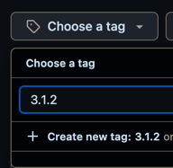

# Deployment procedure

## Prerequisites

* Get familiar with [Docker Swarm](https://docs.docker.com/engine/swarm) its [key concepts](https://docs.docker.com/engine/swarm/key-concepts/#services-and-tasks) and [how it works](https://docs.docker.com/engine/swarm/how-swarm-mode-works/nodes/).
* Get familiar with [GitHub Actions](https://docs.github.com/en/actions).

## Deploying to DEV
Every PR merged to `main` is automatically deployed by our [CD pipeline](https://github.com/AUBGTheHUB/monolith/blob/main/.github/workflows/dev_deploy.yml). You could also manually deploy branches using the [GH Action](https://github.com/AUBGTheHUB/monolith/actions/workflows/dev_deploy.yml). While it is possible to do so, we only recommend doing so, when testing changes to the [Docker Swarm config file](https://github.com/AUBGTheHUB/monolith/blob/main/docker-swarm-stack.yml) or the CD pipeline itself.

## Deployment to PROD
1. Make the `production` branch track the latest `main`. Do **NOT** add commits/merge PRs into `production`, in order to keep the branch clean.
```bash
git checkout production && git reset --hard origin/main && git push
```
Once you push the changes will be automatically deployed by our [CD pipeline](https://github.com/AUBGTheHUB/monolith/blob/main/.github/workflows/prod_deploy.yml)
2. [Create](https://github.com/AUBGTheHUB/monolith/releases/new) a new release

3. Create a new tag using [semantic versioning](https://semver.org/):



4. Choose target `production`:


5. Generate Release notes and edit them if needed. They will include all PRs merged between the previous release and the current one:


6. Publish the Release when you are ready:


### Note:
Manual deployment of the latest commit on `production` is possible via the [GH Action](https://github.com/AUBGTheHUB/monolith/actions/workflows/prod_deploy.yml), though it requires approval from at least one Tech Lead. Deploying branches other than `production` is restricted.

## Rollback
Docker swarm manages rollbacks for us in case a deployed service fails its health check. It will rollback the service one version behind (to the previously deployed version).
The automatic rollback due to a failing healthcheck has been tested, and the total rollback time for the two Python API replicas with the current settings in docker swarm is around 5 minutes.
As we have a `start-first` update policy, no downtime will occur during a successful rollback. The new version of a service is available/visible once the old container has been terminated and the
"current state" of the service is "Running".

You could also check the `UpdateStatus` of service using:

```bash
docker service inspect <service_name>
```
Example of successfully update:
```json
"UpdateStatus": {
    "State": "completed",
    "StartedAt": "2025-06-20T22:52:15.497673121Z",
    "CompletedAt": "2025-06-20T22:54:10.445441567Z",
    "Message": "update completed"
}
```
Example of successful rollback:
```json
"UpdateStatus": {
    "State": "rollback_completed",
    "StartedAt": "2025-06-20T22:39:38.845008959Z",
    "CompletedAt": "2025-06-20T22:45:38.766719642Z",
    "Message": "rollback completed"
}
```
`StartedAt` indicates when the deployment has started.

In case you find a bug that does not cause the healthcheck to fail, and you want to rollback you can execute this on the given VM:
```bash
docker service rollback <service_name>
```

Note: This could be made as a separate workflow where you just pass the commits of the services as inputs and the job will rollback this for you. In this way you minimize SSH-ing into the machine.

## Manifest based deployment
**IMPORTANT!!!** This procedure is experimental and has not been thoroughly tested. **DO NOT USE** this on PROD. It needs further testing and improvements!
In case you want to deploy a specific version of a given service you should:
1. Create a new PR towards `main` where you change the versions specified in the `deployment-manifest.yaml` to a particular commit SHA
2. Merge the PR, this will trigger the [pipeline](https://github.com/AUBGTheHUB/monolith/blob/main/.github/workflows/dev_manifest_based_deploy.yml)) for manifest based deployment on DEV
3. Check if the correct version has been deployed on DEV
4. When you finish set the versions back to `latest`

**IMPORTANT!!!** `latest` means the latest published version in the artifactory registry, so please check which is the last commit deployed on `main`.
