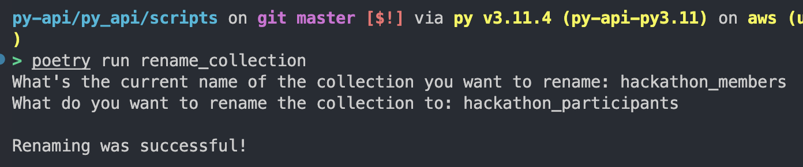

# Python API

## Prerequisites

Check your python version:
```bash
python --version
```
If your version is not `3.11.*`, follow the guides below:
* For [Linux/WSL](https://www.itsupportwale.com/blog/how-to-upgrade-to-python-3-11-on-ubuntu-20-04-and-22-04-lts/)
* For [MacOS](https://apple.stackexchange.com/questions/201612/keeping-python-3-up-to-date-on-a-mac#:~:text=to%20update%20python%20run%20brew,also%20take%20care%20of%20R)

## Installation
1. Navigate to `py-api` directory
2. Run `poetry config virtualenvs.in-project true`
3. Run `poetry install`
4. Copy the path of the newly generated `.venv` folder in `py-api`
5. `Ctrl + Shift + P` and search for `Python: Select Interpreter` in VSCode (`Cmd` instead of `Ctrl` for Mac users) - [Command Palette](https://code.visualstudio.com/docs/getstarted/userinterface#_command-palette)
6. Paste the copied path

## How to run
`poetry run start` will start the server on port `6969`

## Get a list of all endpoints and allowed methods
```bash
# GET /v2/routes HTTP/1.1

curl --location 'localhost:6969/v2/routes'
```


## Scripts
### Renaming a collection


## Utilities:
### Parsing:

#### Request Bodies:

It's **recommended** that you use pydantic in order to easily validate and create parsable bodies to controllers. Read more about it [here](https://fastapi.tiangolo.com/tutorial/body-multiple-params/).

```python
class FeatureSwitch(BaseModel):
    switch_id: str
    is_enabled: bool
```

How to overwrite inherited `model_dump()` method in order to produce serializable dictionaries:

```python
    # model_dump will return the following dict
    # {"endpoint": "something", "url": Url("https://something.com")}
    # which is not serializable

 def model_dump(self) -> Dict[str, str]:
    dumped_model: Dict[str, Any] = super().model_dump()

    dumped_model["url"] = str(dumped_model["url"])
    return dumped_model

```

If for some reason you need to parse the body, but you don't have a pydantic class for it, you can do it the following way:

Parse **request bodies** before passing them to controllers:
```python
from py_api.utilities.parsers import parse_request_body

async def route(request: Request):
    body = await parse_request_body(request.body)

    return controller.operation(body)
```

If you need to pass the full context of the request to the controller and do the body parsing in the controller itself, you need to declare both route and the controller as async and await them.
